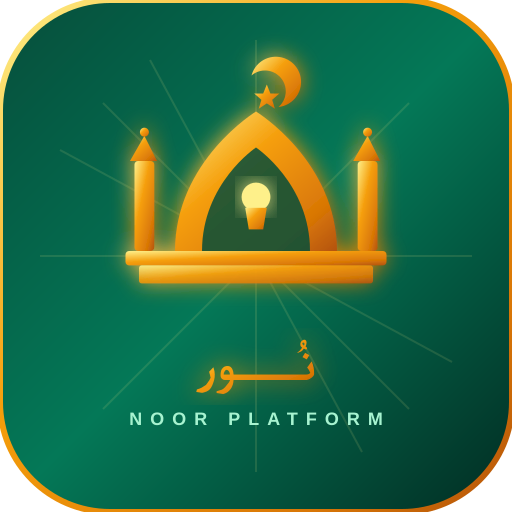
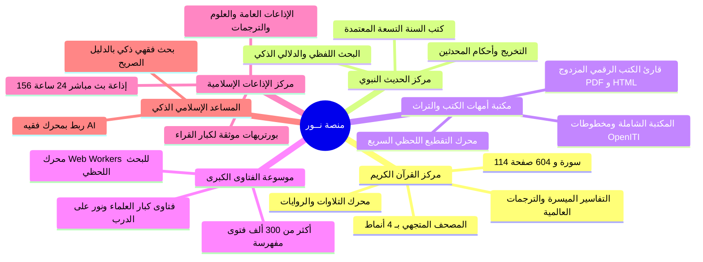

# 🕌 منصة نـور | Noor Platform
### المنصة الإسلامية الشاملة للقرآن الكريم والحديث والمكتبة التراثية والفتاوى والإذاعات
*The Comprehensive Modern Islamic Digital Hub for Quran, Hadith, Classical Heritage, Fatawa & 24/7 Radios*

<div align="center">



[](https://nextjs.org/)
[](https://react.dev/)
[](https://www.typescriptlang.org/)
[](https://tailwindcss.com/)
[](https://web.dev/progressive-web-apps/)
[](LICENSE)

**[🌐 مستودع المشروع الرسمي على GitHub](https://github.com/hozifa460/Noor-Platform)**

</div>

---

## 🌟 نبذة عن المنصة (About Noor Platform)

**منصة نور** هي صرح رقمي إسلامي متكامل ومفتوح المصدر، يجمع بين أصالة العلوم الشرعية وأحدث تقنيات الويب الحديثة والذكاء الاصطناعي. تم تصميم المنصة لتكون المرجع الشامل للمسلم والباحث وطالب العلم، من خلال واجهة عربية فاخرة تدعم اتجاه (RTL) وتعمل بكفاءة فائقة على كافة الأجهزة مع دعم كامل للعمل بدون إنترنت (Offline PWA).

> **Noor Platform** is an enterprise-grade, open-source modern Islamic digital platform that unites the Holy Quran, Prophetic Sunnah, classical heritage manuscripts, encyclopedic Fatwa libraries, and 24/7 live radios within a high-performance web experience.

---

## 📑 الأركان والمراكز الرئيسية في المنصة (Core Hubs)



---

## ✨ المميزات الفنية والشرعية (Key Features)

### 1. 📖 مركز ومصحف القرآن الكريم المتجهي (Vector Quran Hub)
* **المصحف المتجهي الكامل:** عرض دقيق لجميع صفحات المصحف الشريف الـ 604 والـ 114 سورة بخطوط الرسم العثماني المعتمدة.
* **4 أنماط بصرية راقية:** دعم نمط *التذهيب الملكي*، *الورقي القديم (Sepia)*، *الواحة الخضراء*، و*النمط الليلي لشاشات OLED*.
* **محرك التلاوات والتفاسير:** استماع لتلاوات كبار القراء بروايات متعددة (حفص، ورش، قالون، الدوري)، مع تفاسير (السعدي، ابن كثير، الميسر، الطبري) وترجمات معاني القرآن لأكثر من 10 لغات عالمية.
* **نافذة الآية التفاعلية:** عرض الآية مع مفرداتها، إعرابها، أسباب النزول، وتكرار الاستماع للحفظ.

### 2. 📜 مركز الحديث النبوي الشريف (Hadith Hub)
* **كتب السنة التسعة الكبرى:** صحيح البخاري، صحيح مسلم، سنن أبي داود، جامع الترمذي، سنن النسائي، سنن ابن ماجه، موطأ مالك، مسند أحمد، وسنن الدارمي.
* **محرك التحقق والتخريج:** إظهار حكم المحدثين ودرجة صحة الحديث (صحيح، حسن، ضعيف) مع السند والمتن والشروح المعتمدة.
* **بحث دلالي متقدم:** إمكانية البحث بنص الحديث أو بمعناه وموضوعه الفقهي.

### 3. 📚 مكتبة أمهات الكتب والشاملة (Classical Heritage Library)
* **محرك التقطيع اللحظي (On-Demand Page Slicing):** تقنية مبتكرة لقراءة أمهات الكتب التي تتجاوز آلاف الصفحات خلال أقل من **30 جزءاً من الثانية** دون الحاجة لتحميل الكتاب كاملاً.
* **شريط أمهات الكتب في الصدارة:** وصول فوري لتفسير الطبري، سير أعلام النبلاء، البداية والنهاية، فتاوى ابن تيمية، وفتح الباري.
* **تكامل مع مخطوطات OpenITI والمكتبة الشاملة:** فهارس رقمية منظمة ومصنفة حسب الفنون والقرون الهجرية.

### 4. ⚖️ موسوعة الفتاوى الكبرى (Fatwa Search Engine)
* **أكثر من 300,000 فتوى إسلامية مفهرسة:** فتاوى كبار العلماء (ابن باز، ابن عثيمين، اللجنة الدائمة، نور على الدرب، وإسلام ويب).
* **معمارية خيوط المعالجة المتوازية (Web Workers Architecture):** بحث لحظي فائق السرعة عبر المتصفح دون أي بطء أو تجميد لواجهة المستخدم.

### 5. 📻 مركز الإذاعات الإسلامية المباشرة (24/7 Live Radio Hub)
* **156 إذاعة مباشرة تعمل 24/7:** تم فحص وتطهير كافة البثوث الشبكية بروابط موثوقة وعالية النقاء بنسبة 100%.
* **بورتريهات موثقة لكبار القراء:** صور فوتوغرافية حقيقية ورسمية مستوردة من ويكيميديا ومحفوظة محلياً (المنشاوي، عبد الباسط، الحصري، العفاسي، المعيقلي، السديس، الشريم، الطبلاوي، مصطفى إسماعيل، إلخ).
* **تبويبات منظمة:** إذاعات القرآن الكبرى، إذاعات كبار القراء، إذاعات الحديث والتفاسير، وإذاعات ترجمات معاني القرآن.

### 6. 🤖 المساعد الإسلامي الذكي (AI Assistant Trigger)
* زر عائم تفاعلي يعلن عن الربط القادم بمحرك **«فقيه» (Faqih AI)** للإجابات الفقهية الموثقة بالأدلة من الكتاب والسنة.

---

## 🛠️ البنية التقنية (Tech Stack)

| المجال | التقنيات المستخدمة |
|---|---|
| **إطار العمل الأساسي** | [Next.js 16 (App Router + Turbopack)](https://nextjs.org/) & [React 19](https://react.dev/) |
| **لغة البرمجة والأنماط** | [TypeScript 5](https://www.typescriptlang.org/) (Strict Mode) |
| **تصميم الواجهات** | [Tailwind CSS 4](https://tailwindcss.com/) & [shadcn/ui](https://ui.shadcn.com/) & [Radix UI](https://www.radix-ui.com/) |
| **إدارة الحالة العامة** | [Zustand](https://github.com/pmndrs/zustand) (Modular Stores) |
| **محرك التخزين والـ Offline** | IndexedDB, Cache Storage & [Service Workers (PWA)](https://web.dev/progressive-web-apps/) |
| **الوسائط والملفات** | HTML5 Audio Stream Engine, PDF.js, HLS.js, YouTube API |
| **معالجة البيانات والبحث** | Web Workers, Micro-Sharding, SQLite FTS5, Arabic Normalizer |

---

## 🚀 التشغيل والتثبيت المحلي (Local Development)

### المتطلبات الأساسية
* **Node.js** الإصدار `20.x` أو أحدث.
* مدير الحزم **npm** أو **bun** أو **pnpm**.

### خطوات التثبيت:

```bash
# 1. استنساخ المستودع
git clone https://github.com/hozifa460/Noor-Platform.git

# 2. الانتقال إلى مجلد المشروع
cd Noor-Platform

# 3. تثبيت الاعتماديات
npm install

# 4. تشغيل خادم التطوير
npm run dev
```

افتح المتصفح وتوجه إلى الرابط:
👉 `http://localhost:3000`

---

## 🏗️ بناء نسخة الإنتاج (Production Build)

```bash
# تجميع وبناء نسخة الإنتاج المحسنة
npm run build

# تشغيل خادم الإنتاج
npm run start
```

---

## 🧪 حزمة الاختبارات وفحص الجودة (Testing & Verification)

يحتوي المشروع على حزمة اختبارات برمجية شاملة تغطي كافة المحركات:

```bash
# اختبار مركز ومصحف القرآن الكريم
node scripts/test_mushaf_reader.mjs

# اختبار تدفق صفحات الكتب والمكتبة الشاملة
node scripts/test_toc_chunk_streaming.mjs

# اختبار البثوث الإذاعية المباشرة والبورتريهات
node scripts/test_browser_radio_hub.mjs

# اختبار محرك البحث في الفتاوى والـ Web Workers
node scripts/test_fatwa_inverted_index.mjs

# اختبار زر ومودال الذكاء الاصطناعي
node scripts/test_floating_ai_button.mjs
```

---

## 📂 هيكلية المشروع (Project Architecture)

```text
Noor-Platform/
├── public/                     # الملفات الثابتة والصور والخطوط والإذاعات
│   ├── fonts/quran/            # خطوط المصحف العثماني والرسم القرآني
│   ├── images/sheikhs/         # صور وبورتريهات القراء الرسمية الموثقة
│   ├── radio/                  # كتالوج الإذاعات الإسلامية المعتمدة
│   └── workers/                # ملفات الـ Web Workers لمعالجة الفتاوى والبحث
├── src/
│   ├── app/                    # مسارات Next.js App Router وواجهات الـ API
│   │   ├── api/shamela-text/   # محرك تقطيع صفحات الكتب والشاملة اللحظي
│   │   ├── api/sheikh-avatar/  # مولد الهويات البصرية والوسام الإسلامي
│   │   └── page.tsx            # الصفحة الرئيسية وإدارة التنقل والمسارات
│   ├── components/             # واجهات ومكونات التطبيق التفاعلية
│   │   ├── ai/                 # زر ومودال المساعد الإسلامي الذكي
│   │   ├── books/              # قارئ المصحف الشريف وقارئ الكتب والشاملة
│   │   ├── fatwa/              # مركز ومحرك الفتاوى والبحث
│   │   ├── hadith/             # مركز كتب السنة وشروح الأحاديث
│   │   ├── quran/              # مركز السور والتفاسير والترجمات
│   │   └── radio/              # مركز الإذاعات والتصنيفات الصوتية
│   ├── hooks/                  # خطافات React المخصصة (useLibrary, usePdfViewer, ...)
│   ├── lib/                    # المحركات البرمجية وخوارزميات البحث والمعالجة
│   └── stores/                 # مخازن الحالة العامة (Zustand Stores)
├── scripts/                    # أدوات بناء الفهارس وتدقيق الجودة وفحص الروابط
└── README.md                   # التوثيق الشامل للمشروع
```

---

## 🤝 المساهمة والتطوير (Contributing)

نرحب بجميع المساهمات الهادفة لخدمة كتاب الله وسنة نبيه صلى الله عليه وسلم ونشر العلم النافع:
1. قم بعمل **Fork** للمشروع.
2. أنشئ فرعاً لميزتك الجديدة (`git checkout -b feature/NewFeature`).
3. احفظ التعديلات (`git commit -m 'feat: Add NewFeature'`).
4. ارفع الفرع إلى حسابك (`git push origin feature/NewFeature`).
5. افتح **Pull Request** للمراجعة والدمج.

---

## 📜 الترخيص (License)

هذا المشروع مرخص تحت رخصة **MIT** — وقف لله تعالى ومتاح للاستخدام والتطوير الخيري والنافع.

<div align="center">

**منصة نور — نورٌ على نور يهدي به الله من يشاء**

</div>
