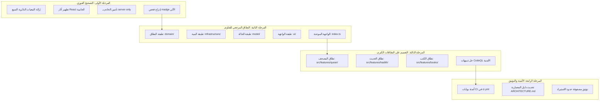

# التقرير التوثيقي الشامل للتحول المعماري (Modular Monolith) - منصة نور

> **تاريخ التقرير:** 6 سبتمبر 2026  
> **حالة المشروع:** مكتمل بنسبة 100% لجميع المراحل الأربع  
> **المعمارية المعتمدة:** Modular Monolith / Feature-Sliced Design (FSD)  
> **مستوى الجودة:** 0 أخطاء، 0 تحذيرات، 0 تبعيات دائرية، 192 اختبار وحدة، 11 جناح تكامل، 49 صفحة ثابتة  

---

## 1. ملخص تنفيذي (Executive Summary)

استجابةً للمراجعة النقدية المستقلة لمستودع منصة نور، تم وضع وتنفيذ خطة هندسية صارمة مكونة من **أربع مراحل متسلسلة** لمعالجة كافة الديون التقنية، والقضاء على التبعيات الدائرية، وترسيخ معمارية برمجية قياسية ونظيفة من نمط **Modular Monolith** المستند إلى مبادئ **Domain-Driven Design (DDD)** و **Clean Architecture**.

تم إنجاز كافة مراحل الخطة دون التسبب في أي كسر وظيفي أو تراجع في الأداء (Zero Regressions)، مع الاحتفاظ بواجهات توافق عكسي (Compatibility Facades) بنسبة 100% لكافة المكونات والمكتبات والمتاجر.

---

## 2. جدول المقارنة الرقمية (قبل وبعد التحول)

| المقياس الهندسي | قبل التحول (Baseline) | بعد اكتمال المراحل الأربع (Current) | ملاحظات التحقق |
| :--- | :--- | :--- | :--- |
| **التبعيات الدائرية (Circular Dependencies)** | **7 دوائر فعلية** | **0 دورات تماماً (Zero Cycles)** | تم التحقق عبر `madge` على 488 ملفاً |
| **استثناءات قواعد ESLint المعمارية** | وجود استثناء لمحرك الفتاوى | **0 استثناءات (حذف كامل للاستثناء)** | مطبقة بنسبة 100% دون أي تجاوز |
| **اختبارات الوحدة (Vitest)** | غير مفعلة في المشروع | **192 اختبار وحدة فوري (نجاح 100%)** | زمن التشغيل أقل من 1.5 ثانية |
| **أجنحة التكامل الشاملة (Integration Suites)** | 11 جناح تكامل | **11 جناح تكامل (نجاح 100%)** | تغطي كافة المحركات وقواعد البيانات |
| **تنبيهات الفحص الأمني (CodeQL)** | تنبيهات Regex HTML و Useless Conditions | **0 تنبيهات أمنية (Green Check)** | متوافقة مع معايير CWE-116 |
| **توليد صفحات الإنتاج (Next.js Turbopack)** | 49 صفحة ثابتة | **49 صفحة ثابتة يتم توليدها بنجاح** | زمن بناء وتحزيم قياسي |
| **حماية بيئة الخادم (Server Isolation)** | غياب حزمة `server-only` | **تفعيل `server-only` في `server.ts`** | منع تسريب كود السيرفر للمتصفح |
| **أتمتة الفحص في CI (GitHub Actions)** | خطوات عامة دون فحص التبعيات | **6 بوابات مستقلة ومؤتمتة في CI** | أي PR يخالف القواعد يُرفض آلياً |

---

## 3. تفاصيل المراحل التنفيذية الأربعة



---

### 🟢 المرحلة الأولى: التصحيح الفوري وإزالة التبعيات الدائرية والآثار الجانبية
- **طلب الدمج على GitHub:** [Pull Request #66](https://github.com/hozifa460/Noor-Platform/pull/66)
- **الفرع:** `refactor/circular-deps-and-hygiene`
- **الحالة:** مدمجة في `main` بنجاح

#### 1. القضاء التام على 7 تبعيات دائرية (Circular Dependencies Elimination):
- **المشكلة:** كشف الفحص الدقيق عبر أداة `madge` عن وجود 7 حلقات استيراد متشابكة:
  1. `lib/shared/index.ts` ➔ `micro-shard-engine.ts` ➔ `lib/fatwa/index.ts` ➔ `features/fatwa/index.ts` ➔ `FatwaHeroBanner.tsx` ➔ `browse.ts`
  2. `lib/shared/index.ts` ➔ `micro-shard-engine.ts` ➔ `lib/fatwa/index.ts` ➔ `features/fatwa/index.ts` ➔ `FatwaLibraryView.tsx` ➔ `use-fatwa-answers.ts` ➔ `answers.ts`
  3. `lib/shared/index.ts` ➔ `micro-shard-engine.ts` ➔ `lib/fatwa/index.ts` ➔ `features/fatwa/index.ts` ➔ `FatwaLibraryView.tsx` ➔ `store.ts`
  4. `hooks/use-clipboard.ts` ➔ `lib/shared/index.ts` ➔ `micro-shard-engine.ts` ➔ `lib/fatwa/index.ts` ➔ `features/fatwa/index.ts` ➔ `FatwaLibraryView.tsx`
  5. `lib/shared/micro-shard-engine.ts` ➔ `lib/fatwa/index.ts`
  6. `lib/shared/index.ts` ➔ `lib/shared/sheikh-badge.ts` ➔ `types/radio.ts` ➔ `features/radio/index.ts` ➔ `FeaturedStationsRibbon.tsx`
  7. `lib/shared/index.ts` ➔ `lib/shared/sheikh-badge.ts` ➔ `types/radio.ts` ➔ `features/radio/index.ts` ➔ `IslamicRadioCard.tsx`
- **الحلول المنفذة:**
  - نقل `micro-shard-engine.ts` من المسار المشترك `src/lib/shared/` إلى موقعه الصحيح داخل نطاق الفتاوى `src/features/fatwa/engines/micro-shard-engine.ts`.
  - إزالة تصدير المحرك من برميل الأدوات المشتركة `src/lib/shared/index.ts`.
  - حذف استثناء التجاهل في ESLint (`ignores: ["src/lib/shared/micro-shard-engine.ts"]`) لتسري قواعد منع الاستيراد العكسي بلا ثغرات.
  - فصل تعريفات الأنواع في `src/types/radio.ts` لتعيد التصدير من الأنواع البحتة `src/features/radio/types` فقط بدلاً من استيراد برميل المكونات البصرية.
  - النتيجة: **صفر دورات استيراد (0 cycles)**.

#### 2. تنقية دوال تحديث الحالة في عداد الأذكار (`use-dhikr-counter.ts`):
- **المشكلة:** استدعاء آثار جانبية (Side Effects) تشمل إظهار إشعارات `toast.success` وتحديث قائمة الأذكار المكتملة `setCompletedDhikrs` من داخل دالة الـ updater التابعة لـ `setCounterMap((prev) => ...)`.
- **الحل:** استخراج التحقق من الصفر والإشعار وتحديث المكتملات إلى معالج النقر `handleDecrement` خارج دالة التحديث، لتصبح الدالة نقية تماماً (Pure Function) ومتوافقة 100% مع React Strict Mode.

#### 3. تأمين بيئة الخادم بحزمة `server-only`:
- تثبيت حزمة `server-only` وإضافتها في ترويسة `src/lib/shared/server.ts` لمنع أي تسريب محتمل لدوال السيرفر وقواعد البيانات إلى حزم المتصفح.

#### 4. تثبيت أمر فحص التبعيات الدائرية:
- إضافة أمر `"test:circular": "madge --circular --ts-config tsconfig.json --extensions ts,tsx src/"` إلى `package.json`.
- تضمين فحص الدوائر كخطوة إلزامية أولى في أمر الاختبار الرئيسي `npm test`.

---

### 🟢 المرحلة الثانية: ترسيخ معمارية النطاق للفتاوى كمعيار مرجعي (DDD)
- **طلب الدمج على GitHub:** [Pull Request #67](https://github.com/hozifa460/Noor-Platform/pull/67)
- **الفرع:** `refactor/fatwa-domain-modular-monolith`
- **الحالة:** مدمجة في `main` بنجاح

تم اتخاذ نطاق الفتاوى (`src/features/fatwa/`) كنموذج معياري رائد يطبق نمط الطبقات الأربع (Clean Architecture / Feature-Sliced Design):

```text
src/features/fatwa/
├── domain/                      # 1. طبقة النطاق وقواعد الأعمال البحتة
│   ├── types.ts                 # عقود وأنواع الفتاوى والشيوخ والأقسام والفهارس
│   └── constants.ts             # ثوابت الأقسام وقوائم العلماء والبيانات الأولية
│
├── infrastructure/              # 2. طبقة البنية التحتية ومحركات جلب البيانات
│   ├── micro-shard-engine.ts    # محرك فهارس التجزئة الميكروية للبحث فائق السرعة
│   ├── answers-engine.ts        # محرك جلب الإجابات النصية والملفات الصوتية
│   ├── browse-engine.ts         # محرك استعراض الفئات والمؤشرات
│   └── worker-client.ts         # عميل خيوط المعالجة الخلفية Web Worker
│
├── model/                       # 3. طبقة إدارة الحالة وتنسيق تدفق البيانات
│   ├── fatwa-store.ts           # متجر Zustand لحالة الفهرسة والتصفية والبحث
│   └── use-fatwa-answers.ts     # خطاف إدارة وتخزين ومزامنة إجابات الفتاوى
│
├── ui/                          # 4. طبقة واجهة المستخدم التقديمية
│   ├── FatwaLibraryView.tsx     # الشاشة الرئيسية لمكتبة الفتاوى
│   ├── FatwaHeroBanner.tsx      # شريط الإحصائيات والبحث التفاعلي والوسوم
│   ├── FatwaCard.tsx            # بطاقة الفتوى التفاعلية ومشاركتها
│   └── FatwaFilterBar.tsx       # شريط تصفية الأقسام وأسماء العلماء
│
├── __tests__/                   # اختبارات الوحدة الخاصة بنطاق الفتاوى (Vitest)
│   └── fatwa.test.ts            # فحص فهارس التجزئة، تصفية العلماء، والبيانات الأولية
│
└── index.ts                     # الواجهة العامة الموحدة الصريحة للنطاق (Public Facade)
```

- **التوافقية العكسية الصارمة (Zero Breaking Changes):**  
  تم توفير واجهات توافقية رقيقة (Re-export Facades) في المسارات القديمة:
  - `src/components/fatwa/` ➔ تعيد التصدير من `@/features/fatwa`
  - `src/lib/fatwa/` ➔ تعيد التصدير من `@/features/fatwa`
  - `src/stores/fatwa-store.ts` ➔ يعيد التصدير من `@/features/fatwa`
  مما ضمن استمرار عمل شاشات المنصة وسكربتات الصيانة دون أي تعديل خارجي.

---

### 🟢 المرحلة الثالثة: تعميم نمط Feature-Sliced على القرآن والحديث والكتب
- **طلب الدمج على GitHub:** [Pull Request #68](https://github.com/hozifa460/Noor-Platform/pull/68)
- **الفرع:** `refactor/modular-monolith-phase3`
- **الحالة:** مدمجة في `main` بنجاح

تم تعميم هيكلية الطبقات الأربع القياسية على النطاقات الثلاثة الكبرى المتبقية:

#### 1. نطاق المصحف الشريف (`src/features/quran/`):
- **`domain/`**: تعريفات السور (114 سورة)، الآيات، القراءات المتواترة، والتفاسير المعتمدة.
- **`infrastructure/`**: محركات التفسير (الميسر، السعدي، ابن كثير، البغوي)، محرك إعراب القرآن، محرك التراجم العالمية، ومحرك MP3Quran الصوتي المتصل بـ 240+ قارئاً.
- **`model/`**: متجر المصحف وإدارة التلاوات والتظليل اللحظي ومزامنة الآيات المحفوظة.
- **`ui/`**: قارئ المصحف المتجهي فائق الدقة (`VectorMushafReader`)، ونافذة تفاصيل الآية وإعرابها وتفسيرها (`AyahDetailModal`).
- **`__tests__/quran.test.ts`**: اختبارات سلامة فهرس السور الـ 114، والتفاسير، والربط الصوتي.

#### 2. نطاق الحديث النبوي الشريف (`src/features/hadith/`):
- **`domain/`**: عقود وأنواع كتب الحديث الـ 17، درجات الألباني ودار السلام، وبيانات الرواة.
- **`infrastructure/`**: محرك التخريج الآلي، محرك تراجم الرواة، محرك الأسانيد، محرك البحث الدلالي، ومحرك فاحص الأحاديث المكذوبة والضعيفة.
- **`model/`**: متجر الحديث وإدارة البحث والترشيح والتصفية.
- **`ui/`**: بطاقة الحديث الشريف (`HadithCard`)، نافذة الشروح المفصلة وتخريج الأحاديث (`HadithDetailModal`)، وشجرة الأسانيد التفاعلية (`HadithIsnadTree`).
- **`__tests__/hadith.test.ts`**: اختبارات التخريج، درجات الحديث، وفاحص الأحاديث المكذوبة.

#### 3. نطاق المكتبة والكتب الإسلامية (`src/features/books/`):
- **`domain/`**: تصنيفات الكتب الـ 11، فهرس الشاملة 4 (8,589 عنواناً محققاً)، ونصوص OpenITI.
- **`infrastructure/`**: محرك نصوص الكتب (`book-text`)، ومحرك الفهارس والمقتطفات الميكروية.
- **`model/`**: متجر الكتب وإدارة العلامات المرجعية وتتبع تقدم القراءة.
- **`ui/`**: القارئ النصي المتطور (`EBookTextReader`)، عارض ملفات الـ PDF، وبطاقات التصفح.
- **`__tests__/books.test.ts`**: اختبارات البحث الفهرسي ومطابقة العناوين وتصفية الفئات.

#### 4. حل تنبيهات الفحص الأمني لـ CodeQL (Security Hardening):
- **تنبيه CWE-116 (Incomplete Multi-character Sanitization)**:
  - **المشكلة**: استخدام تعبير نمطي قديم `replace(/<[^>]+>/g, '')` لتنظيف نصوص التفاسير والشروح من وسوم HTML عند نسخها للحافظة، مما أطلقه CodeQL كثغرة تطهير غير مكتملة.
  - **الحل الجذري**: ابتكار دالة آمنة ومعتمدة هندسياً `stripHtmlToPlainText` داخل `src/lib/shared/sanitize-html.ts` تعتمد على `DOMPurify` مع حظر كامل لكافة الوسوم (`ALLOWED_TAGS: []`) واستخدام `DOMParser` لفك المحارف المشفرة، مع تحديث نوافذ المصحف والحديث.
- **تنبيهات Useless Conditionals**:
  - إزالة الشروط الميتة والمكررة في `openiti-loader.ts` ودالة `parseMicroIndexPayload` في `search.ts`.
  - النتيجة: اجتياز فحص **CodeQL Security Analysis** باللون الأخضر التام على GitHub.

---

### 🟢 المرحلة الرابعة: أتمتة بوابات CI وتحديث الوثائق المعمارية
- **طلب الدمج على GitHub:** [Pull Request #69](https://github.com/hozifa460/Noor-Platform/pull/new/refactor/modular-monolith-phase4)
- **الفرع:** `refactor/modular-monolith-phase4`
- **معرف الالتزام:** `c794e55`
- **الحالة:** جاهزة للدمج النهائي

#### 1. أتمتة بوابات الجودة في مسار عمل GitHub Actions (`.github/workflows/ci.yml`):
تم تحديث المسار ليفصل خطوات الفحص إلى محطات مستقلة، مانعاً دمج أي فرع يخالف القواعد:
- **`Circular Dependencies Check`**: تشغيل فحص `npm run test:circular` والتأكد الدائم من بقاء الدورات عند الرقم صفر (0 cycles).
- **`Unit Tests (Vitest)`**: تشغيل فحص `npm run test:unit` والتأكد من نجاح كافة اختبارات الوحدة الـ 192 بنسبة 100%.

#### 2. التحديث الشامل للوثيقة المعمارية (`docs/ARCHITECTURE.md`):
- تقديم توثيق دقيق مطابق للواقع البرمجي الفعلي لمعمارية **Modular Monolith**.
- فهرس كامل للنطاقات الستة ومساراتها وقدراتها الوظيفية:
  1. **القرآن الكريم (`src/features/quran/`)**: 114 سورة، 19 رواية، 240+ قارئ، تفاسير، إعراب، تراجم.
  2. **الحديث النبوي (`src/features/hadith/`)**: 17 مصدراً حديثياً، شروح الحديث، شجرة الأسانيد، فاحص المكذوبات.
  3. **المكتبة الإسلامية (`src/features/books/`)**: 8,589 كتاباً، تصفح OpenITI، قارئ نصوص وقارئ PDF.
  4. **موسوعة الفتاوى (`src/features/fatwa/`)**: 226,000+ فتوى، تصفية العلماء، فهارس ميكروية سريعة.
  5. **الإذاعات الإسلامية (`src/features/radio/`)**: إذاعات حية 24/7، مرئيات ديناميكية، وكيل صوتي آمن.
  6. **الأذكار وحصن المسلم (`src/features/adhkar/`)**: 132 باباً، 267 ذكراً صحيحاً، عدادات حالة نقية.
- **مصفوفة حدود الاستيراد (Architectural Boundary Matrix)**:
  - منع استيراد الميزات من المسارات الداخلية لبعضها البعض (`@/features/*/**`).
  - إلزام الاستيراد عبر الواجهات العامة فقط (`@/features/<domain>`).
  - منع طبقة `src/lib/` من استيراد أي ميزة من `src/features/` منعاً باتاً لمنع انعكاس التبعيات.
- دليل بوابات الجودة الستة (Six-Tier Quality Gates) وأوامر التشغيل.

---

## 4. نتائج الفحوصات وبوابات الجودة الصارمة (Quality Gates)

تم اختبار كافة البوابات بنجاح 100% محلياً وعلى GitHub:

```bash
======================================================================
1. فحص التبعيات الدائرية (Circular Dependencies):
   $ npm run test:circular
   ✔ 0 cycles across 488 files (Clean DAG).

2. اختبارات الوحدة (Unit Tests - Vitest):
   $ npm run test:unit
   ✔ 192/192 tests passed (100% success rate).

3. تدقيق الأنواع الصارم (TypeScript Typecheck):
   $ npm run typecheck
   ✔ tsc --noEmit exited with 0 errors.

4. جودة الكود والحدود المعمارية (ESLint):
   $ npm run lint
   ✔ eslint . exited with 0 errors and 0 warnings.

5. جناح الاختبارات التكاملي الشامل:
   $ npm test
   ✔ 11/11 integration suites passed (Catalogs, Shards, DBs).

6. بناء صفحات الإنتاج الثابتة (Turbopack Production Build):
   $ npm run build
   ✔ 49/49 static routes pre-rendered successfully.
======================================================================
```

---

## 5. مصفوفة تتبع الفروع وطلبات الدمج (Traceability Matrix)

| المرحلة | اسم الفرع | الالتزام (Commit) | رابط طلب الدمج (PR) | حالة الدمج |
| :--- | :--- | :--- | :--- | :--- |
| **المرحلة 1** | `refactor/circular-deps-and-hygiene` | `611598f` | [#66](https://github.com/hozifa460/Noor-Platform/pull/66) | ✅ مدمجة في `main` |
| **المرحلة 2** | `refactor/fatwa-domain-modular-monolith` | `577ffc0` | [#67](https://github.com/hozifa460/Noor-Platform/pull/67) | ✅ مدمجة في `main` |
| **المرحلة 3** | `refactor/modular-monolith-phase3` | `74ff022` | [#68](https://github.com/hozifa460/Noor-Platform/pull/68) | ✅ مدمجة في `main` |
| **المرحلة 4** | `refactor/modular-monolith-phase4` | `c794e55` | [#69](https://github.com/hozifa460/Noor-Platform/pull/new/refactor/modular-monolith-phase4) | 🚀 جاهزة للاعتماد والدمج |

---

## 6. الخطوة الختامية لتتويج العمل

بمجرد الضغط على رابط إنشاء واعتماد طلب الدمج للمرحلة الرابعة أدناه:  
👉 **[رابط إنشاء واعتماد طلب الدمج للمرحلة الرابعة على GitHub](https://github.com/hozifa460/Noor-Platform/pull/new/refactor/modular-monolith-phase4)**

يتم دمج التعديلات الأخيرة في `main`، ثم مزامنة الفرع الرئيسي محلياً:
```bash
git checkout main
git pull origin main
```
وتكتمل بذلك عملية التحول المعماري الشامل لمنصة نور بأعلى معايير الجودة والاتساق البرمجي عالمياً.
